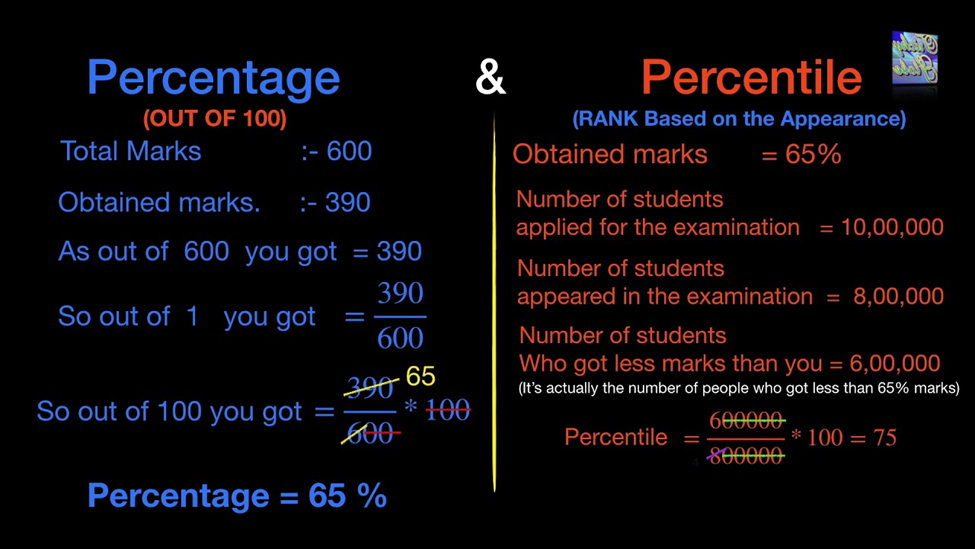

### Even & Odd

### Multiples 

### Factorial 
Its a mathematical operation denoted by n!, where n represents a positive integer,
its the product of all positive integer from 1 to n 
mathematically : (n! = n\times (n-1)) 
0! defined as 1

Use Cases: Factorials are handy for counting permutations of items, for example if we have 3 items (A,B,C) 
there are  3! = 6 ways to arrange them ABC, ACB, BAC, BCA, CAB, CBA. factorial pop up in various fields
combinatorics to probability

To calcilate factorials programmatically, we can use loop.

### Percentage

### Percentile

### Ratio Proportion

## Logical Reasoning
1. Arithmetical Reasoning
2. Decision Making
3. Logical reasoning
4. Number sequence
5. Number series
6. series Completion